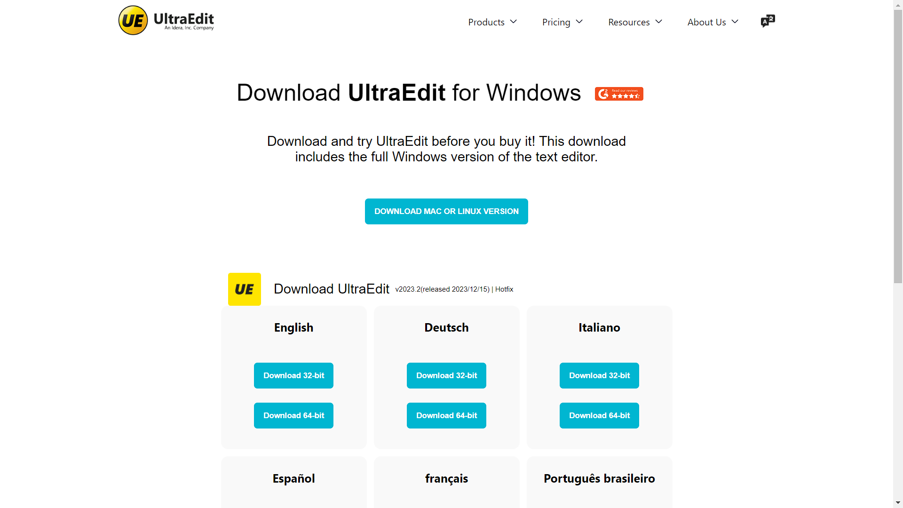

# UltraEdit Download Page

## Description
This page is designed to facilitate the download of UltraEdit, a robust text editor for Windows. It features a user-friendly layout with a clear call to action, ensuring visitors can easily download the software in their preferred language and system architecture.

## Features
- **Prominent Logo**: Ensures brand recognition.
- **Navigation Bar**: Quick access to Products, Pricing, Resources, and About Us sections.
- **Download Section**: A straightforward call to action for downloading UltraEdit for Windows.
- **Multi-language Support**: Offers download links for various languages and system architectures.

## Page Structure
The HTML structure includes:
- `<!DOCTYPE html>`: Specifies the HTML version.
- `<html>`: The root element.
- `<head>`: Contains metadata like character set and title.
- `<body>`: Hosts the visible content.
- `<header>`: Features the logo and navigation bar.
- `<main>`: The core content area with download options.

## Stylesheet
The accompanying `style.css` file defines the aesthetics of the page, including fonts, colors, and spacing.

## Screenshot

## Additional Notes
The provided code outlines the structure and style of the download page. The actual download functionality needs to be implemented separately.

## License
This project is licensed under the MIT License - see the LICENSE file for details.

## Acknowledgements
- **UltraEdit Team**: Thanks to the UltraEdit team for the inspiration.